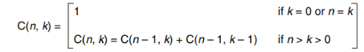
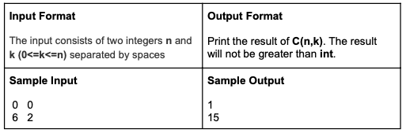

# Recursive Combination

- Please write the program in C/C++
- Please implement both questions with recursive functions.
- You get 0 point if you do not write the program in a recursive way
- Please make sure your program read inputs from stdin and output to stdout
- We won’t test your program with inputs out of the given range, so you don’t need to
  worry about error handling

**The combination of n objects,such as balls in a basket,taken k at a time can be calculated recursively using the formula shown below. Write a recursive function to calculate the number of combinations present in a number.**

