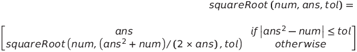
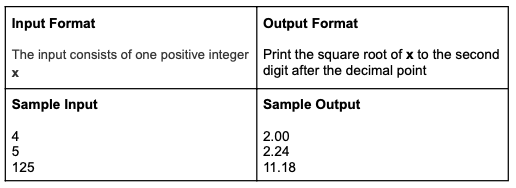

# Recursive Square Root

- Please write the program in C/C++
- Please implement both questions with recursive functions.
- You get 0 point if you do not write the program in a recursive way
- Please make sure your program read inputs from stdin and output to stdout
- We won’t test your program with inputs out of the given range, so you don’t need to
  worry about error handling

**One of the methods to calculate the square root of a number is Newton’s method.**
**The formula for Newton’s method is shown below. Write a recursive function to evaluate the square root of a number using Newton’s method.**

Note:

- In the formula, tol is an abbreviation for tolerance
- In this problem, we use 1 for the initial ans and 0.01 for tol
- For example, the first call of the recursive function should be something like
  squareRoot(4, 1, 0.01) if the input number is 4

