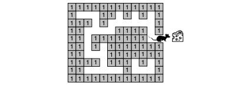

# Stack Mouse Maze

Write a program that simulates a mouse in a maze. The program must print the path taken by the mouse from the starting point to the final point, including all spots that have been visited and backtracked. Thus, if a spot is visited two times, it must be printed two times; if it is visited three times, it must be printed three times.
The maze is shown in Figure 3-25. The entrance spot, where the mouse starts its journey, is chosen by the user who runs the program. It can be changed each time.

A two-dimensional array can be used as a supporting data structure to store the maze. Each element of the array can be black or white. A black element is a square that the mouse cannot enter. A white element is a square that can be used by the mouse. In the array a black element can be
represented by a 1 and a white element by a 0.

When the mouse is traversing the maze, it visits the elements one by one. In other words, the mouse does not consider the maze as an array of elements; at each moment of its journey, it is only in one element. Let’s call this element the currentSpot. It can be represented by a structure of two integer fields. The first field is the row and the second is the column coordinate of the spot in the maze. For example, the exit in Figure 3-25 is at (5,12)— that is, row 5, column 12.

The program begins by creating the maze. It then initializes the exit spot and prompts the user for the coordinates of the entrance spot. The program must be robust. If the user enters coordinates of a black spot, the program must request new coordinates until a white spot is entered. The mouse starts from the entrance spot and tries to reach the exit spot and its reward. Note, however, that some start positions do not lead to the exit.

As the mouse progresses through its journey, print its path. As it enters a spot, the program determines the class of that spot. The class of a spot can be one of the following:

1. Continuing— A spot is a continuing spot if one and only one of the neighbors (excluding the last spot) is a white spot. In other words, the mouse has only one choice.

1. Intersection— A spot is an intersection spot if two or more of the neigh- bors (excluding the last spot) is a white spot. In other words, the mouse has two or more choices.

1. Dead end— A spot is a dead-end spot if none of the neighbors (exclud- ing the last spot) is a white spot. In other words, the mouse has no spot to choose. It must backtrack.

1. Exit— A spot is an exit spot if the mouse can get out of the maze. When the mouse finds an exit, it is free and receives a piece of cheese for a reward.

To solve this problem, you need two stacks. The first stack, the visited
stack, contains the path the mouse is following. Whenever the mouse arrives at a spot, it first checks to see whether it is an exit. If not, its location is placed in the stack. This stack is used if the mouse hits a dead end and must backtrack. Whenever the mouse backtracks to the last decision point, also print the backtrack path.

When the mouse enters an intersection, the alternatives are placed in a second stack. This decision point is also marked by a special decision token that is placed in the visited stack. The decision token has coordinates of (–1,–1). To select a path, an alternative is then popped from the alternatives stack and the mouse continues on its path.

While backtracking, if the mouse hits a decision token, the token is dis- carded and the next alternative is selected from the alternatives stack. At this point print an asterisk (\*) next to the location to show that the next alternative path is being selected.

If the mouse arrives at a dead end and both stacks are empty, the mouse is locked in a portion of the maze with no exit. In this case, print a trapped message and terminate the search for an exit.

After each trial, regardless of the outcome, the user should be given the opportunity to stop or continue.
